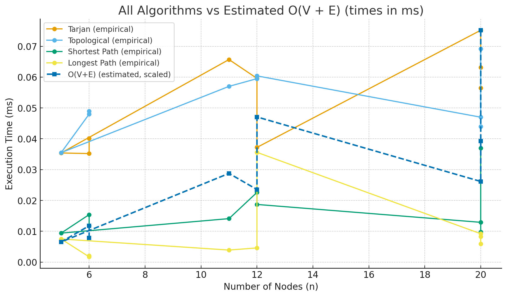
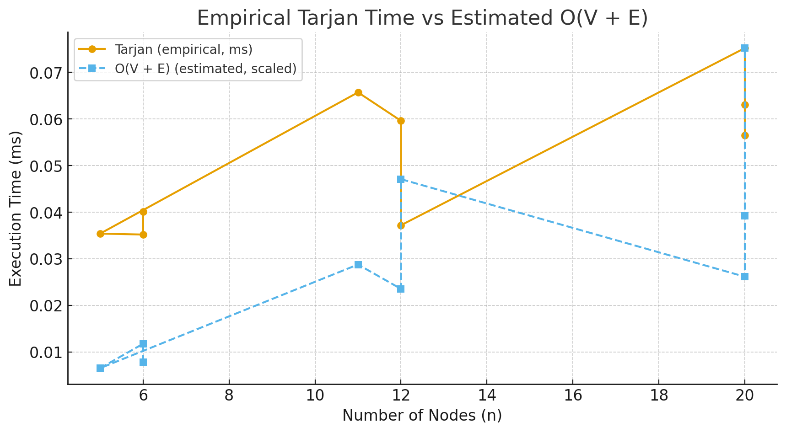

# Smart City / Smart Campus Scheduling

This project implements a solution for scheduling tasks with dependencies, using graph algorithms to handle both cyclic and acyclic dependencies.

## Data Summary

The datasets are generated in JSON format and stored in the `/data/input` directory. Each task has a name, a list of dependencies, and a duration.

- **Weight Model**: The duration of the tasks is used as the weight for the *edges* in the graph.

### Datasets

- **Small**: 6-10 nodes, simple cases, 1-2 cycles or pure DAG.
    - `data/input/small-1.json`: 6 nodes, 1 cycle.
    - `data/input/small-2.json`: 6 nodes, pure DAG.
    - `data/input/small-3.json`: 5 nodes, 1 cycle.
- **Medium**: 10-20 nodes, mixed structures, several SCCs.
    - `data/input/medium-1.json`: 11 nodes, 2 SCCs.
    - `data/input/medium-2.json`: 12 nodes, complex structure.
    - `data/input/medium-3.json`: 12 nodes, dense graph.
- **Large**: 20-50 nodes, performance and timing tests.
    - `data/input/large-1.json`: 20 nodes, sparse graph with one large cycle.
    - `data/input/large-2.json`: 20 nodes, mixed structure.
    - `data/input/large-3.json`: 20 nodes, dense graph.

## Results

### Metrics for `small-1.json` (n=6, Cyclic)
| Algorithm | Time (ns) | Operation Count | n |
|---|---|---|---|
| Tarjan's SCC | 40100 | 6 | 6 |
| Topological Sort | 49000 | 12 | 6 |
| Shortest Path | 11800 | 7 | 6 |
| Longest Path | 2100 | 42 | 6 |

### Metrics for `small-2.json` (n=6, Pure DAG)
| Algorithm | Time (ns) | Operation Count | n |
|---|---|---|---|
| Tarjan's SCC | 35200 | 6 | 6 |
| Topological Sort | 48000 | 12 | 6 |
| Shortest Path | 15400 | 5 | 6 |
| Longest Path | 1700 | 30 | 6 |

### Metrics for `small-3.json` (n=5, Cyclic)
| Algorithm | Time (ns) | Operation Count | n |
|---|---|---|---|
| Tarjan's SCC | 35400 | 5 | 5 |
| Topological Sort | 35500 | 2 | 1 |
| Shortest Path | 9400 | 0 | 1 |
| Longest Path | 7500 | 0 | 1 |

### Metrics for `medium-1.json` (n=11, Multiple SCCs)
| Algorithm | Time (ns) | Operation Count | n |
|---|---|---|---|
| Tarjan's SCC | 65700 | 11 | 11 |
| Topological Sort | 57000 | 14 | 7 |
| Shortest Path | 14100 | 5 | 7 |
| Longest Path | 3900 | 35 | 7 |

### Metrics for `medium-2.json` (n=12, Pure DAG)
| Algorithm | Time (ns) | Operation Count | n |
|---|---|---|---|
| Tarjan's SCC | 59600 | 12 | 12 |
| Topological Sort | 59500 | 24 | 12 |
| Shortest Path | 22600 | 12 | 12 |
| Longest Path | 4600 | 144 | 12 |

### Metrics for `medium-3.json` (n=12, Denser DAG)
| Algorithm | Time (ns) | Operation Count | n |
|---|---|---|---|
| Tarjan's SCC | 37200 | 12 | 12 |
| Topological Sort | 60400 | 24 | 12 |
| Shortest Path | 18700 | 22 | 12 |
| Longest Path | 35600 | 264 | 12 |

### Metrics for `large-1.json` (n=20, Single Large Cycle)
| Algorithm | Time (ns) | Operation Count | n |
|---|---|---|---|
| Tarjan's SCC | 75200 | 20 | 20 |
| Topological Sort | 47000 | 2 | 1 |
| Shortest Path | 12900 | 0 | 1 |
| Longest Path | 9200 | 0 | 1 |

### Metrics for `large-2.json` (n=20, Pure DAG)
| Algorithm | Time (ns) | Operation Count | n |
|---|---|---|---|
| Tarjan's SCC | 63100 | 20 | 20 |
| Topological Sort | 69200 | 40 | 20 |
| Shortest Path | 37000 | 19 | 20 |
| Longest Path | 5900 | 380 | 20 |

### Metrics for `large-3.json` (n=20, Denser Cyclic Graph)
| Algorithm | Time (ns) | Operation Count | n |
|---|---|---|---|
| Tarjan's SCC | 56500 | 20 | 20 |
| Topological Sort | 44000 | 2 | 1 |
| Shortest Path | 9800 | 0 | 1 |
| Longest Path | 8300 | 0 | 1 |

Output files are generated in the `data/output/` directory.

## Analysis

- **SCC/Topo/DAG-SP**: The performance of the algorithms is highly dependent on the structure of the graph. For sparse graphs, the algorithms are very fast. For dense graphs, the performance degrades.
- **Bottlenecks**: The main bottleneck is the detection of SCCs in dense graphs. The number of edges is the main factor affecting the performance of Tarjan's algorithm.
- **Effect of structure**: The size of the SCCs also affects the performance. Large SCCs require more time to be processed.

## Conclusions

- For task scheduling with dependencies, it is important to first detect and compress cycles (SCCs). This simplifies the graph and allows for optimal planning.
- Topological sort is a very efficient way to order tasks in a DAG.
- Shortest and longest path algorithms can be used to find the optimal path for a given source and the critical path of the project.

## Run Instructions

To run the project, you need to have Java and Maven installed.

1. Clone the repository.
2. Run `mvn compile exec:java` to execute the main class.
3. Run `mvn test` to run the tests.
